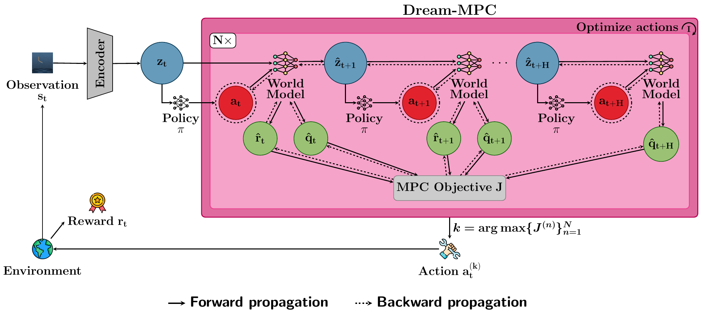

# Dream-MPC: Gradient-Based Model Predictive Control with Latent Imagination

Official implementation for the paper ["Dream-MPC: Gradient-Based Model Predictive Control with Latent Imagination"](https://arxiv.org/abs/2605.04568) by [Jonathan Spieler](https://jspieler.github.io/) and [Sven Behnke](https://www.ais.uni-bonn.de/behnke/). ICML 2026.

[[`Paper`](https://arxiv.org/abs/2605.04568)]
&nbsp;&nbsp;
[[`Project Page`](https://dream-mpc.github.io)]


## Overview

<br/>

Dream-MPC performs gradient-based Model Predictive Control (MPC) with a learned latent world model by using few samples from the policy prior and optimizing each action sequence via gradient ascent to maximize the objective J. The first action with the highest predicted return is applied, and the procedure is repeated for the next time step. 


## Installation

Clone the repository
```bash
$ git clone git@github.com:jspieler/dream-mpc.git
$ cd dream-mpc
```

Start by installing dependencies via `conda` by running the following command:

```bash
$ conda env create -f docker/environment.yaml
$ conda activate dream-mpc
$ pip install gym==0.21.0
```

The `environment.yaml` file installs dependencies required for training on DMControl tasks. Other domains can be installed by following the instructions in `environment.yaml`. If you face any problems with MuJoCo, take a look at [this great guide](https://docs.pytorch.org/rl/stable/reference/generated/knowledge_base/MUJOCO_INSTALLATION.html), which contains troubleshooting tips for common issues.

Depending on your existing system packages, you may need to install other dependencies. See `docker/Dockerfile` for a list of recommended system packages.


We also provide a `Dockerfile` based on the one from TD-MPC2. You can build the docker image by running

```bash
$ cd docker && docker build . -t <user>/dream-mpc:1.0.0
```

This docker image contains all dependencies needed for running DMControl, HumanoidBench, and Meta-World experiments.


## Example usage
We provide a script to download pre-trained TD-MPC2 models provided by the TD-MPC2 authors from _Hugging Face_:
```bash
$ ./models/download_tdmpc2_models.sh
```

You can also train your own TD-MPC2 or BMPC agents by running:
```bash
# for TD-MPC2:
$ python dream_mpc/train.py compile=true task=acrobot-swingup steps=1000000 algo=tdmpc2 num_q=5 log_std_min=-10 log_std_max=2 

# or for BMPC:
$ python dream_mpc/train.py compile=true task=acrobot-swingup steps=1000000 algo=bmpc
```

### Evaluation
To evaluate Dream-MPC with the (pre-)trained models, you can run:
```bash
# for TD-MPC2:
$ python dream_mpc/evaluate.py task=acrobot-swingup seed=2025 algo=dream_mpc_tdmpc2 use_v_instead_q=false num_q=5 log_std_min=-10 log_std_max=2 num_pi_trajs=5 iterations=1 mpc_lr=0.1 regularization_coefficient=0.01 action_reusage_coefficient=0.1 checkpoint=/path/to/models/tdmpc2/acrobot-swingup-1.pt

# or for BMPC:
$ python dream_mpc/evaluate.py task=acrobot-swingup seed=2025 algo=dream_mpc_bmpc num_pi_trajs=5 iterations=1 mpc_lr=0.1 regularization_coefficient=0.1 action_reusage_coefficient=0.1 checkpoint=/path/to/models/bmpc/acrobot-swingup-1.pt
```
**Please make sure you use the correct path to your model checkpoint.**

You can also evaluate standard TD-MPC2/BMPC with MPPI using the following commands:
```bash
# for TD-MPC2:
$ python dream_mpc/evaluate.py task=acrobot-swingup seed=2025 algo=tdmpc2 use_v_instead_q=false num_q=5 log_std_min=-10 log_std_max=2 checkpoint=/path/to/models/tdmpc2/acrobot-swingup-1.pt

# for BMPC:
$ python dream_mpc/evaluate.py task=acrobot-swingup seed=2025 algo=bmpc checkpoint=/path/to/models/bmpc/acrobot-swingup-1.pt
```

If you want to use visual observations, set `obs=rgb`, e.g. for evaluating Dream-MPC (BMPC):
```bash
$ python dream_mpc/evaluate.py algo=dream_mpc_bmpc task=acrobot-swingup obs=rgb checkpoint=/path/to/visual-obs-model/checkpoint.pt seed=2025 num_pi_trajs=5 iterations=1 mpc_lr=0.1 regularization_coefficient=0.01 action_reusage_coefficient=0.1
```

### Training
You can also train a Dream-MPC agent, i.e., using gradient-based MPC already during training instead of MPPI, e.g.:
```bash
$ python dream_mpc/train.py compile=true task=acrobot-swingup steps=1000000 algo=dream_mpc_tdmpc2 use_v_instead_q=false num_q=5 log_std_min=-10 log_std_max=2 num_pi_trajs=5 iterations=1 mpc_lr=0.1 regularization_coefficient=0.01 action_reusage_coefficient=0.1
```

See `config.yaml` for a full list of arguments.

Note that the codebase does currently not support multitask experiments for gradient-based MPC and BMPC.


## Supported tasks
This codebase currently supports continuous control tasks from **DMControl**, **Meta-World**, and **HumanoidBench**, which covers all tasks used in the paper. See below table for expected name formatting:

| domain | task
| --- | --- |
| dmcontrol | dog-run
| dmcontrol | cheetah-run-backwards
| metaworld | mw-assembly
| metaworld | mw-pick-place-wall
| humanoidbench | humanoid_h1-slide-v0
| humanoidbench | humanoid_h1hand-walk-v0

which can be run by specifying the `task` argument for `train.py` or `evaluate.py`.


## Citation

If you find this repo useful, please consider citing our paper as follows:

```
@inproceedings{spieler2026dreammpc,
  title={Dream-{MPC}: Gradient-Based Model Predictive Control with Latent Imagination}, 
  author={Spieler, Jonathan and Behnke, Sven},
  booktitle={International Conference on Machine Learning (ICML)},
  year={2026}
}
```

## Acknowledgments

The code is developed based on [TD-MPC2](https://github.com/nicklashansen/tdmpc2) and [BMPC](https://github.com/wertyuilife2/bmpc).


